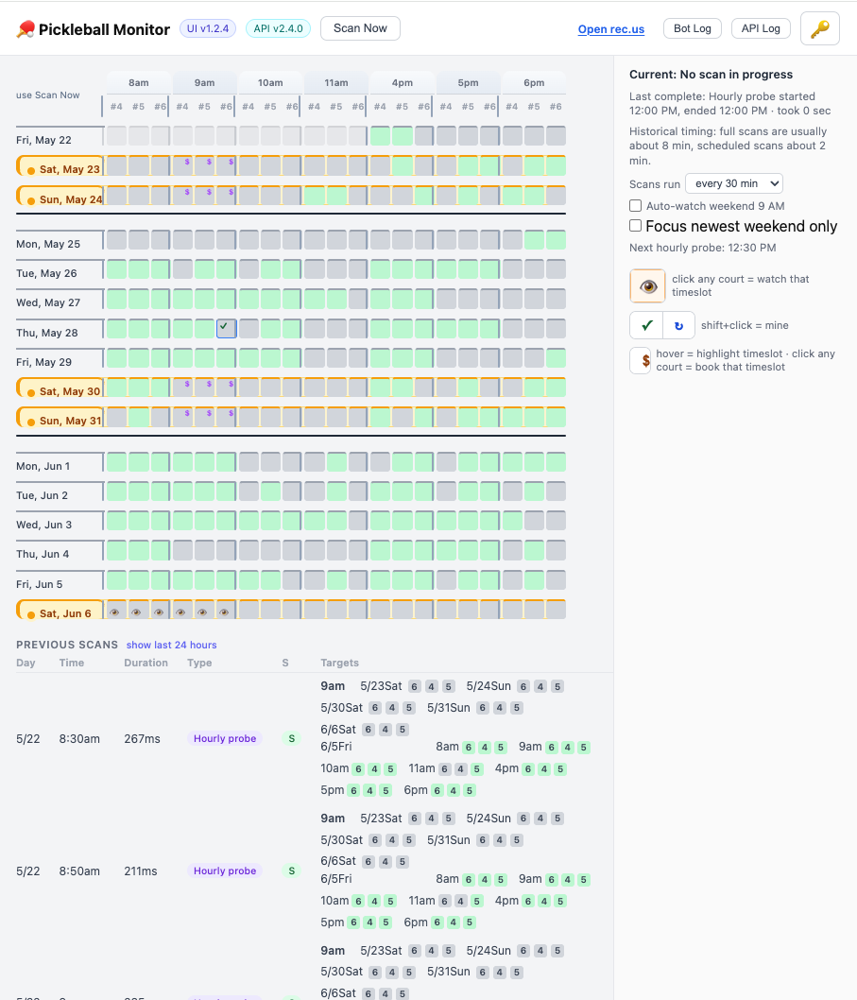

# Pickleball Court Monitor

Automated availability monitor and booking agent for pickleball courts on rec.us (Foster City). Runs on AWS Lambda and notifies via Telegram.

## Screenshot



## What it does

- **Scans** rec.us for open court slots on configured dates
- **Watches** specific slots and sends Telegram alerts when they open up
- **Auto-books** high-priority slots the moment they become available
- **Probes intensively** in the 7:58–8:02 AM window when new slots are typically released
- **Telegram bot** lets you manage watches, trigger scans, and book slots via natural-language chat (powered by Claude)

## Architecture

```
EventBridge (cron) ──► Lambda (Python 3.12 + Playwright)
SQS (delayed probes) ─►  │
Telegram webhook ────────►│
                          │
                    ┌─────┴──────┐
                    S3 (state)   rec.us API
                    SQS          Telegram Bot API
                                 Anthropic Claude API
```

- **Lambda** handles all logic: scheduled scans, booking, and the Telegram bot
- **S3** stores availability state, bot chat history, and scan history
- **SQS** enables sub-15-minute probe precision without sleeping inside a Lambda invocation
- **EventBridge** triggers scans every 15 minutes and fires the 8 AM release probe window
- **Playwright/Chromium** is used only for booking confirmation UI; availability scanning uses the rec.us REST API directly

See [DESIGN.md](DESIGN.md) for the full architecture diagram.

## Project structure

```
monitor.py          # Main Lambda handler — scanning, booking, state, Telegram webhook
authorizer.py       # Separate Lambda for API Gateway HTTP Basic Auth
bot/
  telegram_agent.py # Standalone Telegram polling agent (local dev / alternative runner)
ui/index.html       # Single-file frontend served from S3
deploy.sh           # Build, push to ECR, update Lambda, register Telegram webhook
config.json         # Base URL and default check dates
openapi.yaml        # OpenAPI 3.1 spec
Dockerfile          # Lambda container (Python 3.12 + Playwright + Chromium)
```

## API

Single Lambda Function URL behind HTTP Basic Auth.

| Method | Path | Description |
|--------|------|-------------|
| `GET` | `/state` | Cached per-court availability |
| `GET` | `/scan` | Run a scan (params: `mode`, `days`, `start_date`, `dates`, `time`) |
| `POST` | `/force-scan` | Bypass scan interval and run immediately |
| `PUT` | `/watch` | Add/remove a watched slot |
| `PUT` | `/auto-book` | Configure auto-booking for a slot |
| `GET` | `/my-reservations` | Current reservations synced from rec.us |
| `POST` | `/telegram` | Telegram webhook endpoint |

## Setup

### Prerequisites

- AWS account with Lambda, ECR, S3, SQS, EventBridge configured
- Telegram bot (create via @BotFather)
- rec.us account with court access
- Anthropic API key (for Telegram bot reasoning)

### Environment variables

Copy `.env.example` (or set these in Lambda environment variables):

```
REC_US_LOGIN=your@email.com
REC_US_PASSWORD=your_password
PARTICIPANT_USER_ID=your_rec_us_participant_user_id
FIREBASE_API_KEY=your_firebase_key        # from rec.us web app config
API_USERNAME=your_api_username
API_PASSWORD=your_api_password
TELEGRAM_BOT_TOKEN=your_bot_token
TELEGRAM_CHAT_ID=your_chat_id
TELEGRAM_WEBHOOK_SECRET=random_secret
ANTHROPIC_API_KEY=your-claude-api-key
SYNC_SIGNING_SECRET=random_secret         # for sync token signing (can reuse API_PASSWORD)
STATE_BUCKET=your-s3-bucket-name
REGION=us-west-2
ECR_URI=123456789012.dkr.ecr.us-west-2.amazonaws.com/your-ecr-repo:latest
FUNCTION=your-lambda-function-name
UI_BUCKET=your-ui-s3-bucket
API_BASE=https://your-api-id.execute-api.us-west-2.amazonaws.com/prod
QUEUE_NAME=your-sqs-queue-name
```

### Deploy

```bash
cp .env.example .env   # fill in your values
./deploy.sh
```

`deploy.sh` builds the Docker image, pushes to ECR, updates the Lambda function, and registers the Telegram webhook.

## Telegram bot commands

Talk to the bot naturally. Example interactions:

- "What's open this weekend?"
- "Watch Saturday 8 AM on Court 6"
- "Book it" (in reply to an availability alert)
- "Remove all watches"
- "Show my reservations"
